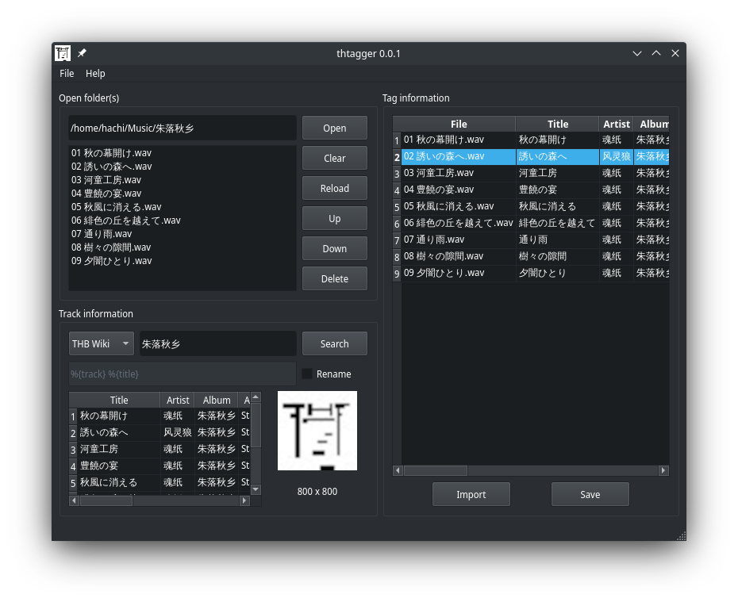

# Thtagger


一个简单的，基于 Python3 、 PySide6 和 [Mutagen](https://github.com/quodlibet/mutagen) 的音乐元数据编辑器。

## 格式支持

1. MPEG-1 Audio Layer 3 (mp3)
2. Waveform Audio File Format (wav)
3. Free Lossless Audio Codec (flac)

## 特性

1. 支持从 THB Wiki 在线搜索元数据
2. wav 格式元数据在 Windows 资源管理器中可以被正常识别

## 使用 PySide2

由于许多 Linux 发行版并没有开始支持 Qt6 ，所以提供了转换成 PySide2 (Qt5) 代码的 patch ：

```shell
$ git apply doc/patches/to_pyside2.patch
```

## 安装

Python 3.8.10 及以上都是测试过支持的。

### Debian stable

手动打上 PySide2 patch 并安装依赖包：

```shell
$ git apply doc/patches/to_pyside2.patch
$ sudo apt-get install python3 \
                       python3-pyside2.qtcore python3-pyside2.qtgui python3-pyside2.qtwidgets \
                       python3-mutagen python3-requests
```

### Archlinux

从 AUR 安装：

```shell
$ yay -S thtagger
```

### Windows

从 [github release](https://github.com/weilinfox/haku-thtagger/releases) 或 [gitee release](https://gitee.com/weilinfox/haku-thtagger/releases) 下载预打包的 x86 架构应用程序包，支持 Windows7 及以上，解压缩后运行 ``thtagger.exe`` 。

## 截图


